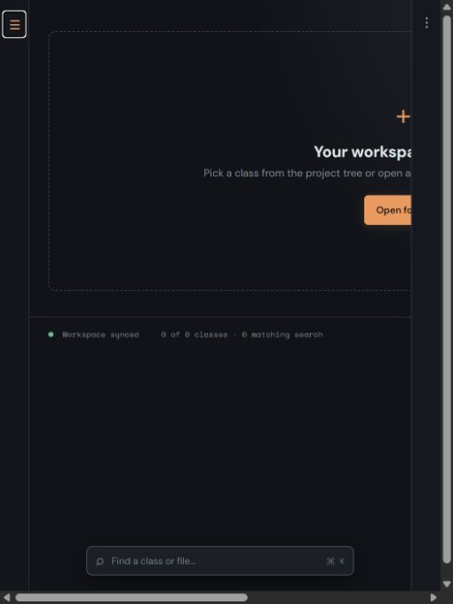
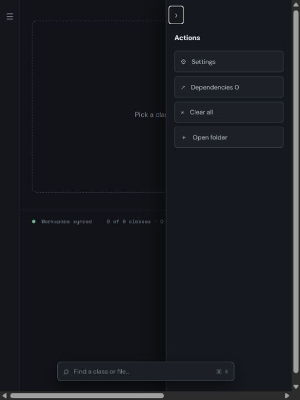

# multiclass
A VS Code-inspired local codebase explorer for visualizing classes, functions, file relationships, and dependencies in a responsive grid.





## Run locally

```bash
npm install
npm run dev
```

To enable native file opening in VS Code, start the local companion agent:

```bash
node agent/server.mjs --project "C:\\path\\to\\your\\project"
```

Or run `start-agent.bat` and pass the project folder as an argument.
